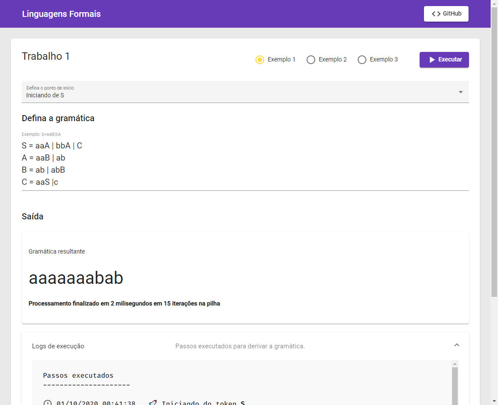

# Linguagens Formais

Este é um repositório relacionado a práticas acadêmicas.

## Trabalho 1

> [Demonstração](https://tiagoboeing.github.io/linguagens-formais/#/)

Implementação da derivação de uma gramática a ser especificada eliminando os símbolos não terminais com a utilização de algoritmos de pilha. Neste cenário, os vetores do JavaScript com auxílio dos métodos `push()` e `shift()`.

Símbolos não terminais são representados por letras maiúsculas.

Examplos válidos de gramáticas: 

- S = aa<ins>**A**</ins> | bb<ins>**A**</ins> | <ins>**C**</ins>
- A = aa<ins>**B**</ins> | ab
- B = ab | ab<ins>**B**</ins>
- C = aa<ins>**S**</ins> |c

> Os símbolos não terminais estão destacados na gramática.
